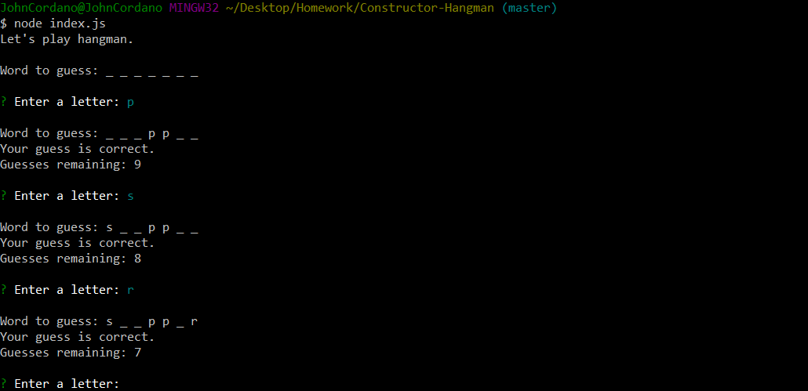

# Constructor Hangman

This application is a hangman game that you play in the teminal. The player is provided with an underline character for each character in the hangman word, and then enters letters when prompted to guess the letters in the word. After each guess, a message indicates if the guess is correct, another message indicates the number of guesses that remain to guess the word, and the word display is updated to replace underline characters with correctly guessed letters. 

When all characters in the word are displayed in the terminal, or when the player fails to display all characters in the word by using the allowed guesses, the game ends, and another game starts.

# Sample Screenshot

The following image shows the data that is displayed in the terminal for the hangman game.

# Tools Used

- JavaScript
- node.js
- Constructor functions
- Inquirer node package